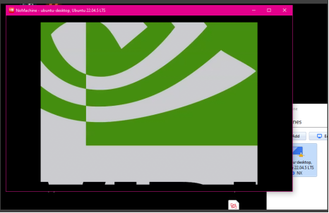
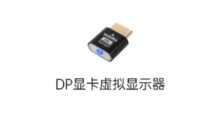
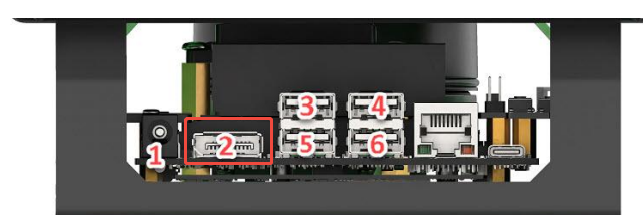

# NoMachine Connected but Only Showed the Wallpaper on My ROSOrin Jetson Orin NX (8GB)

I ran into a small but confusing remote desktop issue while setting up my **ROSOrin Jetson Orin NX (8GB)**.

I installed NoMachine on my Windows PC, followed the normal login steps, and the connection itself worked. The problem was that the remote desktop did not really appear. NoMachine opened a session, but I could only see the Ubuntu wallpaper. There were no desktop icons, no top bar, no dock, and no usable Linux desktop environment.

At first, I thought this was a NoMachine resolution problem. I tried changing display resolution settings several times, but the result stayed the same.

## What the problem looked like

The symptom was specific:

- NoMachine could connect to the ROSOrin device.
- The session window opened normally on my Windows PC.
- Only the background wallpaper was visible.
- No Linux desktop icons, taskbar, dock, or panels appeared.
- Changing NoMachine display resolution did not fix it.

That made the problem easy to misread. Because NoMachine was able to connect, the network and login path looked mostly fine. The broken part was the actual desktop display output.

## The detail I had missed

The useful clue was that this kind of Jetson-based system may need a valid display output attached before the full desktop session renders correctly.

In my case, the key item was the small **HDMI/DP dummy display adapter** included with the hardware package. It acts like a display plug, so the Jetson side can detect a usable monitor output even when I am using the system headlessly through NoMachine.

Without that dummy display adapter, NoMachine may still connect, but the remote desktop can behave as if there is no complete desktop display available. That explains why changing the client-side resolution did not help.

## What I checked next

I then checked the video output area on the Jetson main controller and made sure the dummy display adapter was plugged into the correct display output port.

The practical fix was:

1. Find the HDMI/DP dummy display adapter from the accessory package.
2. Plug it into the Jetson main controller video output port.
3. Disconnect the NoMachine session.
4. Reconnect with NoMachine.
5. If the desktop still does not appear, reboot the ROSOrin device and connect again.

## What I learned

The important lesson is that a successful NoMachine connection does not always mean the remote desktop display is configured correctly.

If NoMachine connects to a ROSOrin Jetson Orin NX system but only shows the wallpaper, I would not spend too much time changing resolution settings first. I would check whether the HDMI/DP dummy display adapter is installed on the Jetson video output port.

For headless robotics setups, that small adapter can be the difference between a remote session that technically connects and a remote session that actually shows a usable Ubuntu desktop.