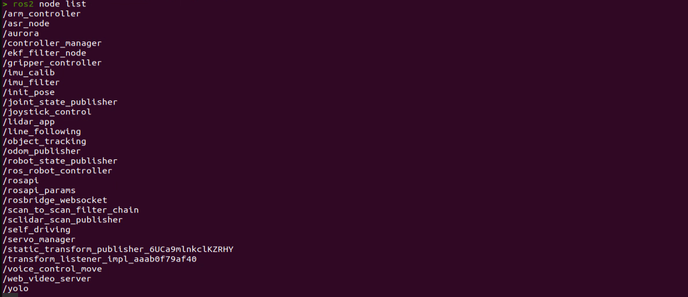
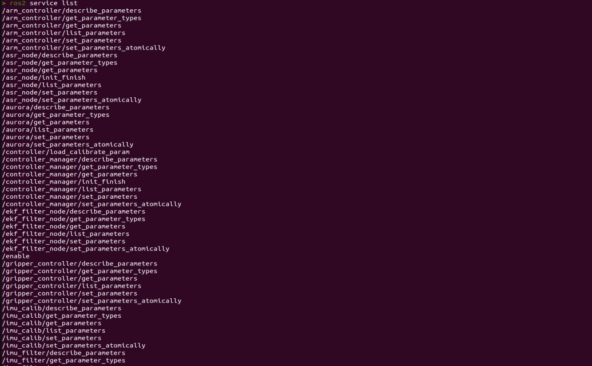
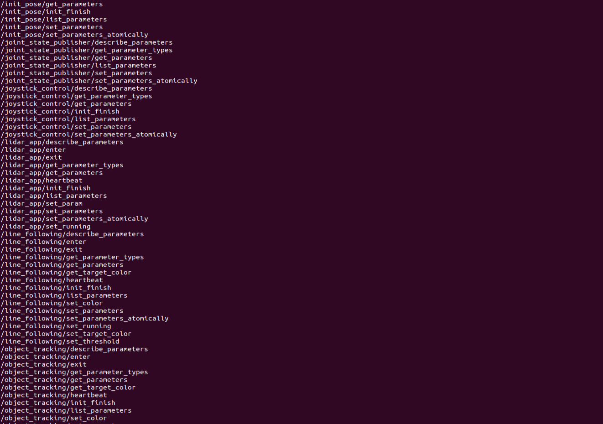
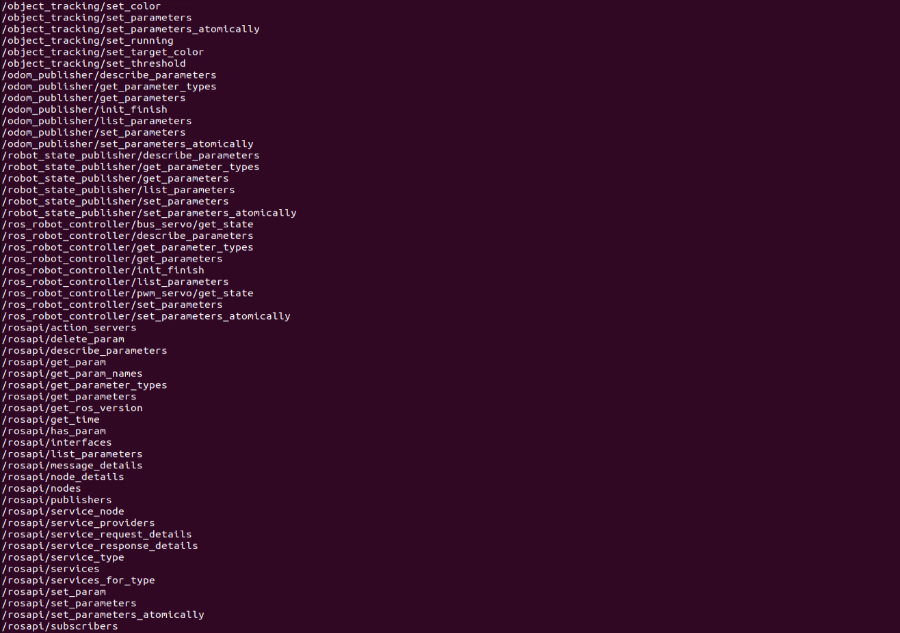
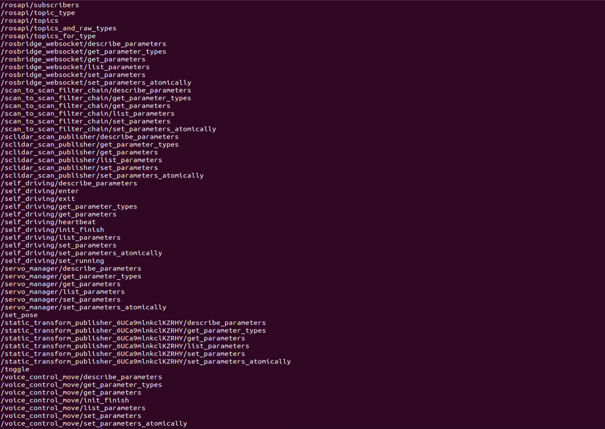
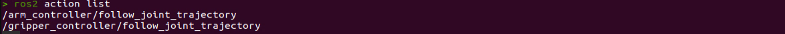

# Pre-Purchase Notes: Evaluating a ROS 2 Mobile Manipulator for Custom Embodied AI Research

I have been looking into ROS 2 mobile manipulators for a small embodied AI research setup. My goal was not to buy a robot that only runs prebuilt education demos. I wanted a platform where I could insert my own control layer between perception, decision-making, and physical execution.

The core question I wanted to answer before purchase was simple:

**Can this kind of robot support custom ROS 2 development, or is it mainly a closed demo platform?**

More specifically, I wanted to know whether I could read sensor data, run a custom Python ROS 2 node, make decisions in my own policy layer, and then approve, block, or replace the robot’s default motion commands.

After reviewing the available ROS 2 interfaces, launch structure, and technical responses, the platform I focused on was **ROSOrin Pro**. My conclusion is that it looks suitable for custom embodied AI and ROS 2 research, but it should be treated as a development platform rather than a turnkey research product.

It provides many of the right building blocks, but a team still needs to be comfortable with ROS 2 integration, command arbitration, safety validation, and live-system testing.

## What I Wanted to Check Before Buying

For my use case, the robot needed to support an external embodied AI control layer like this:

```text
Camera / lidar / IMU / odometry
              |
              v
    Custom Python ROS 2 node
              |
              v
  Policy, safety, and arbitration
              |
              v
Chassis / arm / gripper / Nav2 commands
```

This requires more than a demo app. The platform needs to expose sensor data, control topics, navigation actions, inverse-kinematics interfaces, and robot model resources. It also needs a practical way to stop or bypass default high-level behavior when running a custom controller.

The most important things I wanted to verify were:

- Whether the main ROS 2 topics, services, actions, and nodes are accessible.
- Whether custom Python ROS 2 nodes can be added.
- Whether the arm can be controlled without modifying closed internal source code.
- Whether the default app, AI, or OpenClaw workflows can be stopped.
- Whether standard Nav2 actions are available.
- Whether the chassis, arm, gripper, camera, lidar, IMU, and odometry interfaces are accessible.
- Whether MoveIt, URDF/Xacro, joint limits, and collision resources are included.
- Whether there is a clear command-priority mechanism when multiple control sources publish commands.
- Whether the arm really meets the DOF requirements of the project.

## Short Conclusion

Based on the available information, I would not treat ROSOrin Pro as only a closed educational demo robot. It appears to expose enough ROS 2 interfaces to support custom Python nodes, navigation experiments, sensor-based decision-making, mobile manipulation, and embodied AI control experiments.

The strongest points are:

- ROS 2 topics, services, actions, and nodes are exposed.
- Custom Python ROS 2 nodes can read sensor data and publish control commands.
- The inverse-kinematics function can be called through ROS 2 services.
- Standard Nav2 actions are available.
- The default app, AI, and OpenClaw workflows can be bypassed while keeping low-level drivers active.
- MoveIt, URDF/Xacro, joint-limit, and collision resources are included.
- The main chassis, arm, gripper, camera, lidar, IMU, and odometry interfaces are accessible.

The main caveats are also important:

- I did not see a clearly confirmed built-in command-priority mechanism for competing control sources.
- The arm should be understood as five independently controlled arm joints plus one gripper control joint, not a strict six-axis robotic arm.
- Integration should be treated as self-directed ROS 2 development.
- The live delivered unit should still be verified before building a project around it.

For a team that already understands ROS 2, this is a workable base. For a team expecting a fully turnkey embodied AI research stack, it may require more engineering work than expected.

## ROS 2 Interface Coverage

The first thing I wanted to confirm was whether the robot exposes the normal ROS 2 graph instead of hiding everything behind a proprietary application.

The useful commands for checking this kind of platform are:

```bash
ros2 node list
ros2 topic list -t
ros2 service list -t
ros2 action list -t
```



The reported node list includes control, state-publishing, filtering, sensor, and application components.









For my project, the most relevant interfaces are the ones connected to chassis control, arm control, gripper control, sensors, navigation, and robot state.

| Function                   | Interface                                     | Type                                        |
| -------------------------- | --------------------------------------------- | ------------------------------------------- |
| Main chassis velocity      | `/controller/cmd_vel`                         | `geometry_msgs/msg/Twist`                   |
| Alternate chassis velocity | `/cmd_vel`                                    | `geometry_msgs/msg/Twist`                   |
| App/Ackermann velocity     | `/app/cmd_vel`                                | `geometry_msgs/msg/Twist`                   |
| Low-level motor command    | `/ros_robot_controller/set_motor`             | `ros_robot_controller_msgs/msg/MotorsState` |
| Direct servo position      | `/servo_controller`                           | `servo_controller_msgs/msg/ServosPosition`  |
| Joint position input       | `/joint_controller`                           | `sensor_msgs/msg/JointState`                |
| Arm trajectory             | `/arm_controller/follow_joint_trajectory`     | `control_msgs/action/FollowJointTrajectory` |
| Gripper trajectory         | `/gripper_controller/follow_joint_trajectory` | `control_msgs/action/FollowJointTrajectory` |
| IK target pose             | `/kinematics/set_pose_target`                 | `kinematics_msgs/srv/SetRobotPose`          |
| Filtered lidar             | `/scan`                                       | `sensor_msgs/msg/LaserScan`                 |
| Filtered odometry          | `/odom`                                       | `nav_msgs/msg/Odometry`                     |
| Filtered IMU               | `/imu`                                        | `sensor_msgs/msg/Imu`                       |

The arm and gripper trajectory actions also appear in the action list:

```text
/arm_controller/follow_joint_trajectory
/gripper_controller/follow_joint_trajectory
```



This interface coverage is broad enough for a custom external controller. It means the robot does not need to be controlled only through its default app workflow.

## Custom Python ROS 2 Nodes

A key requirement for my project was the ability to add custom Python ROS 2 nodes.

In a typical embodied AI experiment, a custom node might:

1. Subscribe to RGB-D images, lidar, IMU, odometry, and robot-state data.
2. Run perception, scene understanding, or a policy model.
3. Apply a local safety and permission check.
4. Publish chassis commands to `/controller/cmd_vel`.
5. Call inverse kinematics for end-effector targets.
6. Send arm or gripper trajectories through `FollowJointTrajectory` actions.
7. Send navigation goals through standard Nav2 actions.
8. Cancel or block motion when the policy is uncertain.

This is the main reason the platform looks useful for research. The important point is not just that demos exist, but that the exposed ROS 2 graph allows a user-defined controller to sit above the low-level motion and sensor stack.

However, this also means the user must design the control logic carefully. Basic access is not the hard part. The hard part is deciding which controller is allowed to command the robot at each moment.

## Inverse Kinematics Through ROS 2 Services

One concern I had was whether a non-editable inverse-kinematics implementation would block custom arm control.

For this platform, the IK implementation can be accessed through ROS 2 services. The main service is:

```text
/kinematics/set_pose_target
```

An example service call looks like this:

```bash
ros2 service call /kinematics/set_pose_target kinematics_msgs/srv/SetRobotPose \
"{position: [0.20, 0.0, 0.25], pitch: 0.0, pitch_range: [-180.0, 180.0], resolution: 1.0}"
```

The request fields are:

| Field         | Meaning                                                     |
| ------------- | ----------------------------------------------------------- |
| `position`    | Target `[x, y, z]` position in meters.                      |
| `pitch`       | Target pitch angle in degrees.                              |
| `pitch_range` | Search range used when the requested pitch has no solution. |
| `resolution`  | Search resolution.                                          |

The service returns success status, servo pulse values, current pulse values, roll-pitch-yaw data, and the minimum variation value.

Other kinematics-related services include:

```text
/kinematics/get_current_pose
/kinematics/set_joint_value_target
/kinematics/set_link
/kinematics/get_link
/kinematics/set_joint_range
/kinematics/get_joint_range
```

For a custom embodied AI controller, this service boundary is useful. The policy layer can generate end-effector targets, call the IK service, and then decide whether to execute the result.

This is not the same as having full editable access to the IK solver source code, but for many research and prototype use cases, service-level access is enough.

## Bypassing the Default App and OpenClaw Workflows

Another important point was whether the robot could keep low-level drivers running while stopping the default high-level behavior.

The platform appears to separate upper-level AI, OpenClaw, app, and demo workflows from the lower-level ROS 2 stack. That matters because a custom controller should not be fighting against the default app or demo program.

Low-level components that would usually need to remain active include:

```text
controller.launch.py
servo_controller.launch.py
kinematics_node.launch.py
camera launch files
lidar launch files
IMU launch files
Nav2 or other navigation launch files
```

Upper-level launch files that may be stopped or omitted include:

```text
openclaw_controller/launch/start.launch.py
openclaw_controller/launch/navigation_manager.launch.py
openclaw_controller/launch/smart_scene_navigation.launch.py
openclaw_controller/launch/claw_object_track.launch.py
openclaw_controller/launch/claw_track_and_grab.launch.py
openclaw_controller/launch/yolo_node.launch.py
voice, vision-language model, and large-model demo scripts
```

The default startup service is associated with:

```text
start_app_node.service
```

The exact service name should still be checked on the physical unit:

```bash
systemctl list-units | grep -i openclaw
systemctl list-units | grep -i ros
systemctl list-units | grep -i app
```

Useful commands include:

```bash
ros2 launch bringup bringup.launch.py
sudo systemctl stop start_app_node.service
```

I would verify the ROS 2 graph before and after stopping the default service:

```bash
ros2 node list
ros2 topic list -t
ros2 service list -t
ros2 action list -t
```

This check is important because the goal is not simply to stop the app. The goal is to confirm that the required low-level nodes remain active after the upper-level workflow is stopped.

## Command Arbitration Is the Main Integration Risk

This is the biggest caveat I found.

The chassis control node subscribes to several velocity command topics:

```text
/controller/cmd_vel
/cmd_vel
/app/cmd_vel
```

Each incoming velocity message can eventually be converted into a motor command. If a custom node and another source publish at the same time, such as the app, joystick, AI demo, or OpenClaw process, the robot may follow whichever command arrives last.

That can cause:

- Motion jitter
- Unpredictable steering
- Intermittent response
- Failure to remain stopped
- Confusing test results
- Unsafe behavior during experiments

The arm and gripper can have similar problems because direct servo commands, joint commands, and trajectory actions eventually enter the same actuation chain.

I did not find a clearly confirmed built-in priority mechanism for these competing sources. For my own implementation, I would plan one of the following approaches:

1. Stop all default motion publishers before enabling the custom controller.
2. Add `twist_mux` for multiple chassis command sources.
3. Use a state machine to assign one active controller at a time.
4. Add a control lease so only one module owns the robot during a task.
5. Add mutual exclusion for arm and gripper commands.
6. Treat the safety layer as the final gate before actuator commands are published.

This is not a reason to reject the platform. It is a normal integration issue for a robot that exposes multiple control paths. But it should be planned from the beginning.

For embodied AI experiments, I would not allow the policy model to publish directly to the robot without an arbitration and safety layer.

## Nav2 Availability

The navigation stack exposes standard Nav2 actions rather than only a proprietary wrapper.

Relevant actions include:

```text
/navigate_to_pose
/navigate_through_poses
/follow_path
/compute_path_to_pose
/compute_path_through_poses
/follow_waypoints
```

This is useful because a custom ROS 2 application can send navigation goals directly to Nav2, cancel goals, monitor progress, and decide when navigation should be allowed.

OpenClaw may provide higher-level wrappers, but for a custom embodied AI architecture, direct Nav2 access is usually cleaner. It keeps navigation decisions inside the user’s own control layer.

The live robot should still be checked with:

```bash
ros2 action list -t
ros2 service list -t
```

## Sensor Access

For embodied AI experiments, sensor access is just as important as motion control.

The available sensor interfaces cover the main inputs needed for mobile manipulation:

- RGB images
- Camera calibration data
- Depth images
- Point clouds
- Raw and filtered lidar scans
- Raw, corrected, and filtered IMU data
- Raw and EKF-filtered odometry
- Button status
- Gamepad status
- Battery status

When `aurora` or `ascamera` is used, RGB-D data is remapped under:

```text
/depth_cam
```

When `DEPTH_CAMERA_TYPE=usb_cam`, only RGB images and camera information are published.

This distinction matters. If the project requires depth images or point clouds, the camera configuration in the selected package should be confirmed before purchase.

## Robot Model, MoveIt, and Arm Configuration

The platform includes robot description and planning resources such as:

- URDF/Xacro files
- MoveIt configuration
- Joint limits
- Collision meshes
- SRDF data
- `ros2_control` configuration
- Gazebo-related resources

These resources reduce the amount of setup work needed for simulation, planning, and custom motion experiments.

However, the arm configuration should be understood clearly.

The arm model defines limits for:

```text
joint1
joint2
joint3
joint4
joint5
```

The gripper is controlled through:

```text
r_joint
```

The remaining gripper links use mimic joints.

So the practical control structure is:

```text
5 independently controlled arm joints
+
1 gripper control joint
```

This matters because some product descriptions may informally count the gripper and make the robot sound like a six-degree-of-freedom arm. For a project that strictly requires a six-axis manipulator, this should be evaluated carefully.

For projects that can work with five arm joints plus a gripper, the included MoveIt and model resources are still useful.

## Physical Stop and Safety

The main physical stop method is the robot’s power switch. Turning off the main power switch shuts down the robot and stops movement directly.

For research use, I would still implement software-level safety in the custom controller, such as:

- Maximum velocity limits
- Workspace limits
- Collision checks
- Command timeout
- Manual stop command
- Policy confidence threshold
- Final command gate before actuator output

I would treat the power switch as the direct physical stop and the software safety layer as the normal operational protection.

## Software Environment

The reference software environment is:

```text
Ubuntu 22.04.5 LTS
ROS 2 Humble
Python 3.10.12
JetPack 6.2
```

These versions should be confirmed on the delivered unit before locking dependencies or building a long-term development environment.

For a research project, I would verify:

```bash
lsb_release -a
ros2 --version
python3 --version
cat /etc/nv_tegra_release
```

I would also save the output of:

```bash
ros2 node list
ros2 topic list -t
ros2 service list -t
ros2 action list -t
```

This creates a baseline snapshot of the delivered system.

## Who This Platform Seems Suitable For

Based on the interface information, ROSOrin Pro seems suitable for:

- Custom Python ROS 2 control nodes
- Embodied AI policy experiments
- Chassis control experiments
- Mobile manipulation research
- Sensor fusion with RGB-D, lidar, IMU, and odometry
- Standard Nav2 navigation
- MoveIt-based planning
- Projects that can implement their own arbitration and safety layer
- Teams comfortable with ROS 2 debugging and integration

I would be more cautious if the project requires:

- A strict six-axis robotic arm
- Fully editable IK source code
- A confirmed built-in priority system for all competing commands
- Turnkey embodied AI integration
- Extensive secondary-development support without internal ROS 2 experience
- A separate industrial-style emergency-stop circuit

## My Pre-Purchase Takeaway

My main takeaway is that this platform appears to provide the right technical foundation for custom ROS 2 and embodied AI experiments, but it should not be treated as a finished research framework.

The value is in the exposed interfaces:

- Sensors can be read through ROS 2.
- Chassis commands can be published through ROS 2.
- Arm and gripper trajectories are available through ROS 2 actions.
- IK can be called through ROS 2 services.
- Navigation can use standard Nav2 actions.
- Robot model and planning resources are available.
- Default high-level workflows can be stopped or bypassed.

The main work left to the user is system integration:

- Verify the live ROS 2 graph.
- Stop unneeded default publishers.
- Add command arbitration.
- Add a safety layer.
- Confirm camera configuration.
- Confirm arm DOF requirements.
- Test every control path on the delivered unit.

For a team prepared to do that work, ROSOrin Pro looks like a practical base for mobile manipulation, ROS 2 development, and embodied AI experimentation.

For a team expecting a plug-and-play embodied AI robot with all control ownership and safety policies already solved, it may require more development effort than expected.
